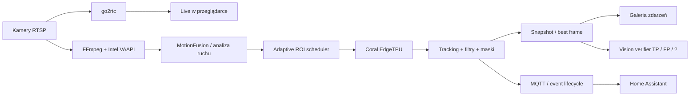

<p align="center">
  
</p>

<p align="center">
  <strong>Local-first AI Vision / NVR for RTSP cameras</strong><br>
  szybka detekcja obiektów, Coral EdgeTPU, Intel VAAPI, go2rtc, Vision verification i natywna integracja z Home Assistant.
</p>

<p align="center">
  
  
  
  
  
</p>

---

## Czym jest VEYRA?

**VEYRA AI-NVR** to lokalny system analizy obrazu z kamer IP, zaprojektowany przede wszystkim pod **szybką detekcję, niski narzut CPU, czytelne snapshoty i integrację z automatyką domu**.

Projekt nie próbuje być klasycznym rejestratorem zapisującym wszystko 24/7. Aktualny kierunek to **detection-first**: kamera, ruch, inteligentnie dobrany ROI, Coral, tracking, snapshot i natychmiastowa informacja dla użytkownika. Dzięki temu zasoby są przeznaczane na analizę tego, co naprawdę dzieje się w kadrze.

VEYRA działa lokalnie — bez obowiązkowej chmury do detekcji, Live czy automatyki.

### Główne założenia

- **RTSP / kamery IP** jako źródło obrazu;
- **Intel VAAPI** do sprzętowego dekodowania wideo;
- **Coral EdgeTPU** do szybkiego inference modeli INT8;
- **go2rtc** jako lekki i płynny transport Live;
- analiza ruchu i planowanie ROI przed inferencją;
- tracking obiektów bez dokładania zbędnych przebiegów detektora;
- osobne profile dla dnia, IR, białego światła nocnego i glare;
- snapshoty, Galeria, diagnostyka i Vision verification;
- pełna obsługa z telefonu;
- **Home Assistant przez dedykowaną integrację HACS**.

---

## Architektura



### Live jest niezależny od pipeline'u AI

Transport podglądu jest możliwie prosty:

```text
browser → nginx → go2rtc → kamera
```

Live nie jest przepychany przez Pythonowy relay obrazu. Detekcja może pracować równolegle, a overlay AI pozostaje lekką warstwą nad płynnym video.

---

## Najważniejsze funkcje

| Moduł | Co robi |
| --- | --- |
| **Live / Monitor Wall** | płynny podgląd kamer, mobilny zoom i drag, widok wielu kamer, Live Track i status wykrytej klasy |
| **MotionFusion** | analizuje ruch na mniejszej rozdzielczości i kieruje detektor tylko tam, gdzie jest to potrzebne |
| **Coral EdgeTPU** | wykonuje inferencję INT8 na planowanych ROI; źródłowy ROI może mieć różny rozmiar, model finalnie dostaje swój stały input |
| **Tracking** | utrzymuje obiekt pomiędzy inferencjami i pozwala ograniczyć liczbę kosztownych wywołań detektora |
| **Night / Illumination Guard** | rozróżnia DAY, NIGHT_IR i NIGHT_WHITE_COLOR, a GLARE działa jako modyfikator przejściowy |
| **Maski** | motion masks, object masks i odrzucanie według pokrycia bboxa; maskę można testować na prawdziwym snapshotcie z Galerii |
| **Filtry klas** | score, area, proporcje W/H i reguły per klasa z czytelnym podglądem bboxa |
| **Galeria** | snapshoty zdarzeń, bbox, score, dane detekcji, podgląd Coral oraz Vision Debug |
| **Vision** | dodatkowa ocena snapshotu jako TP / FP / niepewne z możliwością ręcznej korekty |
| **Statystyki** | host, kamery, FFmpeg/VAAPI, Coral, liczba inferencji, pominięte przebiegi schedulera i czasy Vision |
| **Mobile UI** | responsywny panel, Live, Galeria, Logi, ustawienia i jasny/ciemny motyw |
| **Updater** | aktualizacja z panelu z walidacją paczki, backupem, health-checkiem i rollbackiem |

---

## Detekcja zaprojektowana pod wydajność

VEYRA nie wysyła bez przerwy całej klatki do Corala. Pipeline najpierw wykorzystuje ruch, istniejące tracki, historię sceny i reguły rechecku, a dopiero później planuje region do inferencji.

To pozwala zachować szybkie wykrycie obiektu bez dokładania drugiego przebiegu Corala tylko po to, aby „upewnić się” o tej samej klatce.

W praktyce ważne są trzy warstwy:

1. **Discovery** — wykrycie ruchu i wybór regionu.
2. **Coral** — pojedynczy inference dla zaplanowanego ROI.
3. **Tracking / confirmation** — utrzymanie i potwierdzanie obiektu w czasie.

### Wiatr i duży ruch sceny

W scenach z drzewami, trawą lub intensywnym ruchem tła VEYRA może ograniczyć częstotliwość nowych discovery ROI, nie odbierając priorytetu już śledzonemu człowiekowi czy samochodowi.

---

## Noc, IR, białe światło i glare

Noc nie jest traktowana jako jeden profil obrazu.

VEYRA rozróżnia:

- **DAY** — zwykły obraz dzienny;
- **NIGHT_IR** — klasyczny nocny obraz z podczerwieni;
- **NIGHT_WHITE_COLOR** — noc z oświetleniem białym / kolorowym obrazem;
- **GLARE** — przejściowy modyfikator dla mocnego źródła światła, reflektora lub latarki skierowanej w stronę kamery.

Illumination Guard, white-light protection i adaptacyjne maski są projektowane tak, aby reakcja na zmianę oświetlenia nie wymagała agresywnego podnoszenia globalnych progów detekcji.

---

## Maski, filtry i testowanie na prawdziwym zdarzeniu

Maski można oceniać nie tylko na bieżącym Live.

W edytorze można wybrać snapshot z Galerii dla aktualnej kamery. VEYRA odtwarza zapisany `snapshot_box`, wybiera klasę eventu i od razu pokazuje:

- procent pokrycia bboxa przez maskę;
- próg `reject_overlap_percent`;
- końcowy wynik **ODRZUCI / PRZEPUŚCI**.

Dzięki temu strojenie maski nie wymaga czekania, aż człowiek lub samochód ponownie pojawi się dokładnie w tym samym miejscu.

---

## Galeria i Vision verification

Galeria jest częścią pipeline'u diagnostycznego, a nie tylko listą zdjęć.

Każde zdarzenie może przechowywać m.in. klasę, score, bbox, wybraną klatkę, obraz wejściowy użyty przez Coral oraz dane potrzebne do późniejszej analizy.

Opcjonalny moduł **Vision** może dodatkowo ocenić snapshot jako:

- **TP** — prawidłowa detekcja;
- **FP** — false positive;
- **?** — wynik niepewny.

Wynik można skorygować ręcznie. Dzięki temu VEYRA może zbierać wiedzę o problematycznych fragmentach sceny bez automatycznego „uczenia się” błędu bez kontroli użytkownika.

---

## Interfejs

VEYRA ma własny responsywny panel WWW z jasnym i ciemnym motywem.

### Panel główny

- Live kamer i stan Motion / Detection;
- lekkie ramki AI;
- klasy i score aktywnych obiektów;
- ostatnie zdarzenia;
- globalne sterowanie kamerami, detekcją i snapshotami.

### Monitor Wall

Widok wielu kamer do szybkiego podglądu bez przechodzenia między stronami.

### Widok pojedynczej kamery

- Live;
- Live Track;
- przełączanie kamer;
- tryby Vision / Coral / Debug;
- ustawienia i testowanie filtrów.

### Galeria

- szybkie filtrowanie eventów;
- czytelne oznaczenie klasy i score;
- Vision verdict;
- podgląd czystego kadru, Coral input i Vision Debug;
- ręczna korekta TP / FP.

### Statystyki

Osobna sekcja telemetryczna dla hosta, kamer, Corala i Vision — bez dokładania inferencji wyłącznie po to, aby wygenerować statystykę.

---

## Home Assistant + HACS

<p align="center">
  
</p>

VEYRA ma osobną, natywną integrację **Home Assistant**, przygotowaną do instalacji przez **HACS jako Custom Repository / Integration**:

**[SlaVkoKRK/veyra-home-assistant](https://github.com/SlaVkoKRK/veyra-home-assistant)**

Po instalacji integrację dodaje się standardowo z:

**Ustawienia → Urządzenia i usługi → Dodaj integrację → Veyra**

Do konfiguracji wystarczy adres / host VEYRA i port panelu WWW. Integracja sama pobiera informacje o kamerach, aktywnym modelu, klasach, go2rtc i MQTT.

### Co pojawia się w Home Assistant

- osobne encje **Camera** dla kamer VEYRA;
- sensory binarne **Motion**, **Objects**, **Night** i **Online**;
- globalne przełączniki **AI Detection**, **Notifications** i **Snapshots**;
- te same przełączniki również **per kamera**;
- dynamiczne poziomy powiadomień dla klas modelu: **Wyłączone / Ciche / Normalne / Pilne / Krytyczne**;
- atrybuty aktywnych obiektów z klasami i liczbą detekcji.

### Powiadomienia bez budowania własnych automatyzacji

Integracja obsługuje natywny lifecycle zdarzenia VEYRA:

```text
prealert → confirmed → repeat
```

- **prealert** — pierwszy szybki alert;
- **confirmed** — potwierdzenie zapisanego eventu;
- **repeat** — ponowne ostrzeżenie, gdy obiekt nadal jest aktywny.

Można wybrać telefony `notify.mobile_app_*`, które mają otrzymywać alerty, oraz ustawić osobny poziom ważności dla każdej klasy modelu.

Obraz powiadomienia korzysta z wersjonowanego `current.jpg`, dzięki czemu kolejny alert tego samego aktywnego zdarzenia może pokazać nowszą i lepszą klatkę zamiast obrazu z cache.

Po restarcie VEYRA integracja potrafi odtworzyć stan i ponownie podłączyć subskrypcję MQTT bez ręcznego przeładowywania integracji.

---

## Typowe środowisko

VEYRA jest rozwijana z myślą o niewielkich serwerach domowych i edge AI, m.in.:

- Proxmox / LXC;
- Intel iGPU z VAAPI;
- Coral PCIe / USB EdgeTPU;
- kamery Dahua / inne RTSP;
- modele YOLO INT8 przygotowane pod EdgeTPU;
- Home Assistant + MQTT.

System nie wymaga konkretnej marki kamery, jeżeli dostępny jest stabilny strumień zgodny z używanym pipeline'em.

---

## Prywatność i bezpieczeństwo repozytorium

Repozytorium publiczne nie powinno zawierać danych produkcyjnych.

Nie publikujemy tutaj:

- haseł do kamer;
- danych MQTT;
- prywatnych adresów i konfiguracji środowiska;
- snapshotów z prywatnych kamer;
- baz wydarzeń;
- modeli należących do użytkownika.

Konfiguracja przykładowa powinna zawierać wyłącznie placeholdery. Zasady bezpieczeństwa opisuje `SECURITY.md`.

---

## Zakres projektu

VEYRA jest obecnie rozwijana przede wszystkim jako **AI detection / vision appliance**. Priorytetem są:

- szybkość pierwszego wykrycia;
- niskie użycie CPU;
- dobra praca małych i odległych obiektów;
- odporność na noc, światła i ruch tła;
- użyteczne snapshoty;
- transparentna diagnostyka;
- automatyka przez Home Assistant.

**Ciągłe nagrywanie nie jest obecnie głównym celem projektu.**

---

<p align="center">
  <strong>VEYRA</strong><br>
  Cameras · Motion · Coral · Vision · Home Assistant
</p>
