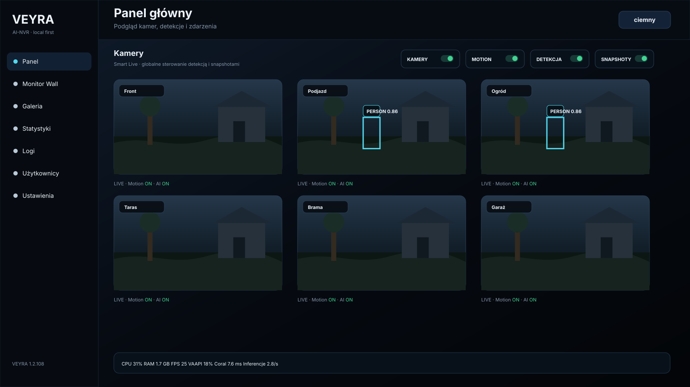
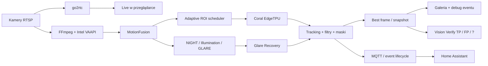
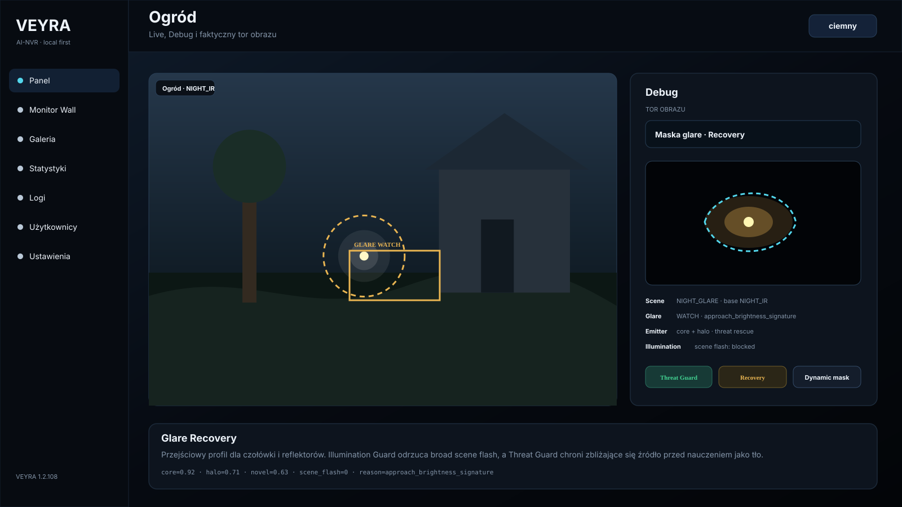
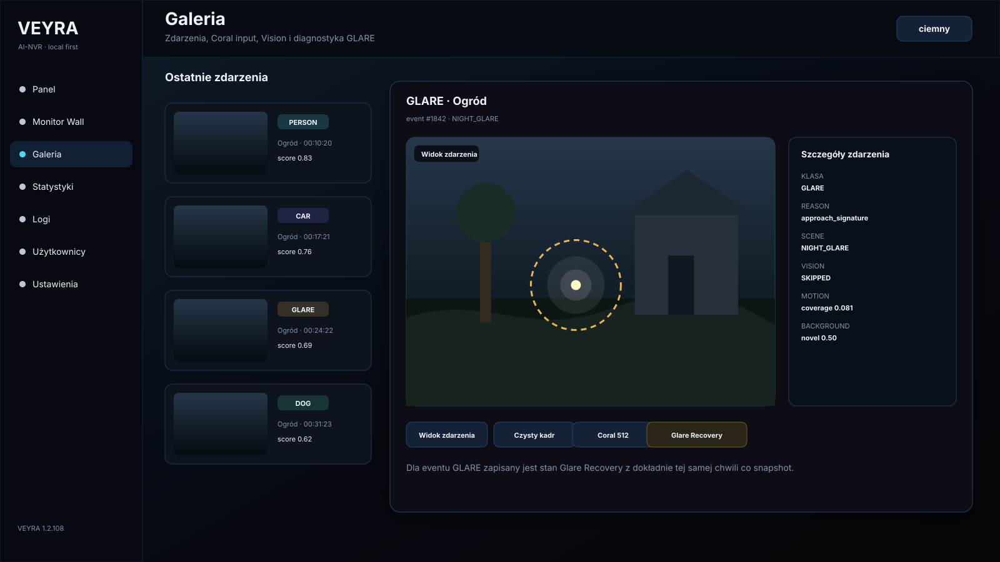
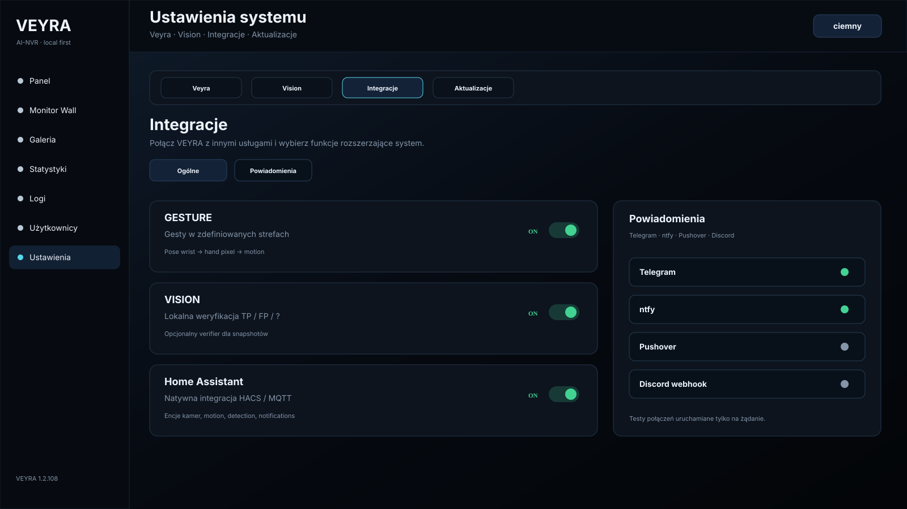

<p align="center">
  
</p>

<p align="center">
  <strong>Local-first AI Vision / NVR for RTSP cameras</strong><br>
  Detection-first · Coral EdgeTPU · Intel VAAPI · go2rtc · NIGHT/GLARE · Vision Verify · Gesture · Home Assistant
</p>

<p align="center">
  
  
  
  
  
</p>

---

## Czym jest VEYRA?

**VEYRA AI-NVR** to lokalny system analizy obrazu dla kamer RTSP/IP. Projekt jest rozwijany przede wszystkim jako **AI detection / vision appliance**, a nie klasyczny rejestrator zapisujący wszystko 24/7.

Główny przepływ jest prosty:

```text
kamera → motion → ROI → Coral → tracking → event → snapshot → automatyka
```

VEYRA wykorzystuje Intel VAAPI do dekodowania, Coral EdgeTPU do inference, go2rtc do Live i własny pipeline MotionFusion / ROI / tracking, którego celem jest szybkie wykrycie obiektu przy możliwie małym narzucie CPU.

Najważniejsza zasada projektu:

> **jedna analiza obrazu → wielu konsumentów**

To znaczy, że kolejne moduły powinny wykorzystywać już policzone dane, zamiast dokładać drugi Coral pass, drugi resize pełnej klatki albo osobny kosztowny pipeline tylko na potrzeby UI czy diagnostyki.

---

## Interfejs

<p align="center">
  
</p>

Panel WWW jest responsywny i przygotowany zarówno pod desktop, jak i telefon. Z jednego miejsca można kontrolować kamery, Motion, Detection, snapshoty, przeglądać zdarzenia i obserwować stan hosta / VAAPI / Coral.

> Zrzuty w README przedstawiają rzeczywisty układ i nazewnictwo GUI VEYRA, ale używają syntetycznych klatek demonstracyjnych — repozytorium nie publikuje prywatnych obrazów z kamer.

### Najważniejsze elementy GUI

- Panel główny z kamerami i globalnymi przełącznikami;
- Monitor Wall;
- widok pojedynczej kamery z Live / Debug;
- Gallery / event details;
- Coral 512 — faktyczne wejście detektora;
- maski i filtry klas;
- NIGHT / IR / White Light / GLARE debug;
- Statystyki hosta, kamer, VAAPI i Corala;
- Logi runtime;
- Integracje, Vision, Gesture i aktualizacje;
- jasny i ciemny motyw;
- layout mobilny.

---

## Architektura



### Live jest niezależny od pipeline'u AI

```text
browser → nginx → go2rtc → kamera
```

VEYRA nie przepycha Live przez Pythonowy relay obrazu. Detekcja działa równolegle, a overlay AI jest lekką warstwą nad strumieniem Live.

---

## Detection-first

VEYRA nie wysyła bez przerwy całej klatki do Corala. Najpierw analizowany jest ruch i stan tracków, a dopiero potem planowany jest ROI dla detektora.

Pipeline można uprościć do trzech warstw:

1. **Discovery** — MotionFusion wykrywa interesujący ruch i wskazuje region.
2. **Inference** — pojedynczy Coral pass dla zaplanowanego ROI.
3. **Tracking / confirmation** — obiekt jest utrzymywany i potwierdzany w czasie bez bezsensownego ponawiania inference na każdej klatce.

W scenach z drzewami, trawą lub wiatrem VEYRA może ograniczać nowe discovery ROI bez odbierania priorytetu już śledzonemu człowiekowi lub samochodowi.

### Stationary / Static FP Guard

VEYRA rozróżnia prawdziwy ruch obiektu od jitteru bboxa. Sam pojedynczy `position_change` trackera nie wystarcza do potwierdzenia ruchu — analizowana jest historia bboxów i lokalny MotionFusion.

Ma to ograniczać typowe false positive'y typu:

- trawa widziana jako PERSON;
- roślina / słupek / fragment budynku;
- statyczny obiekt, którego bbox delikatnie „pływa” między inference.

Osoba, która weszła w kadr i później stoi, pozostaje śledzona i podlega okresowemu stationary recheck.

---

## NIGHT, IR, White Light i GLARE

VEYRA nie traktuje „nocy” jako jednego profilu.

- **DAY** — standardowy obraz dzienny;
- **NIGHT_IR** — nocny obraz IR;
- **NIGHT_WHITE_COLOR** — noc po przejściu kamery na białe światło / kolor;
- **NIGHT_GLARE** — przejściowy profil, gdy reflektor, czołówka lub inne silne źródło światła utrudnia detekcję.

<p align="center">
  
</p>

### Glare Recovery

GLARE nie jest tylko progiem jasności. Pipeline bierze pod uwagę m.in.:

- jasny rdzeń źródła;
- bloom / halo;
- wzrost powierzchni i jasności;
- trajektorię małego źródła z daleka;
- MotionFusion;
- Illumination Guard;
- Dynamic Glare Mask;
- Threat Guard;
- learned background / recovery mask.

**Illumination Guard** ma odróżniać otwarcie drzwi / LIGHT_ON / broad scene flash od lokalnego zbliżającego się reflektora. **Threat Guard** chroni świeże, zbliżające się źródło przed nauczeniem go jako statyczne tło.

Brak aktualnego `PERSON` lub `CAR` nie jest twardym veto: człowiek z czołówką albo samochód może zostać całkowicie zasłonięty przez własne światło.

### Diagnostyka GLARE w Galerii

<p align="center">
  
</p>

Dla eventu GLARE Galeria może przechować stan **Glare Recovery** dokładnie z chwili zdarzenia. Obok normalnego event view dostępne są m.in.:

- Widok zdarzenia;
- Czysty kadr;
- Coral 512;
- **Glare Recovery**.

Dzięki temu po fakcie można sprawdzić, co system naprawdę widział w momencie alertu, zamiast analizować maskę, która kilka sekund później wygląda już inaczej.

---

## Maski i filtry

VEYRA ma kilka warstw filtrowania:

- Motion masks;
- object masks;
- procentowe odrzucanie bboxa według pokrycia maską;
- dynamiczne maski tła;
- Dynamic Glare Mask;
- filtry score / area / W:H per klasa;
- strefy i reguły runtime.

Maskę można testować na istniejącym evencie z Galerii. UI odtwarza zapisany bbox i pokazuje procent pokrycia oraz wynik **ODRZUCI / PRZEPUŚCI** bez czekania, aż obiekt ponownie pojawi się w tym samym miejscu.

---

## Galeria jako narzędzie diagnostyczne

Galeria nie jest tylko listą miniaturek.

Event może przechowywać m.in.:

- klasę i score;
- bbox;
- najlepszą klatkę;
- czysty kadr;
- dokładny Coral input 512×512;
- scenę DAY / NIGHT / GLARE;
- dane MotionFusion;
- wynik masek i filtrów;
- Vision verdict;
- Glare Recovery dla eventów GLARE.

To pozwala analizować false positive i false negative na danych z dokładnie tej chwili, w której detektor podjął decyzję.

---

## Vision Verify

VISION jest opcjonalną integracją i może być całkowicie wyłączony.

Gdy jest aktywny, snapshot może dostać dodatkowy verdict:

- **TP** — prawidłowa detekcja;
- **FP** — false positive;
- **?** — niepewne;
- wynik można poprawić ręcznie.

Vision nie zastępuje Corala i nie bierze udziału w podstawowym inference obiektów. Jest dodatkową warstwą oceny eventu oraz źródłem danych do późniejszej analizy problematycznych obszarów sceny.

Po wyłączeniu Vision znikają elementy Vision w Ustawieniach / Logach / Galerii, ale podstawowe widoki Coral, Maski, Scena, Czysty kadr i event details pozostają dostępne.

---

## Gesture

VEYRA posiada opcjonalny moduł rozpoznawania gestów w zdefiniowanych strefach.

Pipeline jest warstwowy:

```text
POSE WRIST → HAND PIXEL → MOTION fallback
```

- polygon zones z wieloma punktami;
- kilka polygonów pod jedną logiczną strefą;
- draggable reference PERSON;
- Wave;
- Circle CW / CCW;
- Up / Down;
- osobny debug źródła trackingu dłoni;
- Pose uruchamiane tylko, gdy Gesture jest ARMED.

Gesture jest feature flagiem — po wyłączeniu recognizer, konfiguracja i logi Gesture znikają z aktywnego UI.

---

## Integracje

<p align="center">
  
</p>

Integracje są rozdzielone na funkcje systemowe i kanały powiadomień.

### Ogólne

- Gesture;
- Vision;
- Home Assistant / HACS / MQTT.

### Powiadomienia

- Telegram;
- ntfy;
- Pushover;
- Discord webhook;
- szablony wiadomości;
- testy providerów uruchamiane tylko na żądanie.

---

## Home Assistant + HACS

<p align="center">
  
</p>

Dedykowana integracja:

**[SlaVkoKRK/veyra-home-assistant](https://github.com/SlaVkoKRK/veyra-home-assistant)**

Integracja udostępnia m.in.:

- encje Camera;
- Motion / Objects / Night / Online;
- globalne i per-camera AI Detection;
- Notifications;
- Snapshots;
- poziomy powiadomień per klasa;
- aktywne klasy i liczbę detekcji;
- lifecycle eventów `prealert → confirmed → repeat`.

VEYRA może być więc używana nie tylko jako panel kamer, ale także jako lokalny sensor wizualny dla automatyki domu.

---

# VEYRA i Frigate — wspólne korzenie, inny kierunek

VEYRA powstała na bazie **doświadczeń z używania Frigate** i świadomie korzysta z podobnej filozofii edge AI: lokalne przetwarzanie, motion-first detection, akceleracja sprzętowa, Coral, MQTT, go2rtc i integracja z Home Assistant.

**VEYRA nie próbuje być kopią Frigate ani zamiennikiem 1:1.** Projekt rozwinął osobny pipeline i skupia się na innych priorytetach.

Frigate jest dojrzałym, pełnym NVR-em i oferuje m.in. recording/review, semantic search, face recognition, GenAI i rozbudowane enrichmenty. VEYRA jest obecnie bardziej wyspecjalizowanym detection-first appliance i nie próbuje udawać, że w każdym zastosowaniu będzie lepszym wyborem.

### Gdzie podejście jest podobne

Oba projekty stawiają na:

- lokalne przetwarzanie obrazu;
- motion jako sygnał do uruchamiania detekcji;
- akcelerację sprzętową;
- tracking obiektów;
- maski / strefy / filtry;
- go2rtc / Live;
- MQTT i Home Assistant;
- możliwość pracy z Coral EdgeTPU.

### Co VEYRA robi inaczej

Poniższe elementy są projektowymi rozszerzeniami VEYRA i **nie są częścią standardowego, udokumentowanego pipeline'u Frigate w tej samej formie**:

| VEYRA | Podejście |
| --- | --- |
| **NIGHT_GLARE** | osobny przejściowy profil sceny dla czołówek i reflektorów |
| **Glare Recovery** | odzyskiwanie obrazu + core/halo + zapis recovery mask z chwili eventu |
| **Threat Guard + Dynamic Glare Mask** | ruchome / rosnące źródło ma priorytet nad learnerem tła |
| **Illumination Guard** | rozdzielenie broad scene flash od lokalnego zagrożenia GLARE |
| **Coral 512 w event details** | podgląd dokładnego obrazu przekazanego do inference |
| **Event-first debug** | scena, czysty kadr, Coral input, maski i GLARE analizowane z jednego eventu |
| **Vision TP / FP / ?** | opcjonalny verifier snapshotu z ręczną korektą verdictu |
| **Gesture** | polygon zones + Pose wrist + pixel hand + motion fallback |
| **Mask overlap preview** | test maski na historycznym evencie z procentem pokrycia bboxa |
| **Static FP Guard** | pre-TP analiza jitteru bboxa, historii ruchu i local MotionFusion |

### Gdzie Frigate ma inny, szerszy zakres

Frigate może być lepszym wyborem, jeśli najważniejsze są:

- pełny NVR i ciągłe nagrywanie;
- rozbudowany Review / Explore;
- semantic search;
- face recognition;
- GenAI object descriptions / chat;
- rozbudowany ekosystem i duża społeczność;
- bardziej kompletna platforma archiwizacji materiału wideo.

VEYRA może być ciekawsza dla osób, które wolą:

- detection-first zamiast recording-first;
- bardzo szczegółową diagnostykę tego, **dlaczego** event powstał;
- własne mechanizmy nocne i GLARE;
- eksperymentalne funkcje edge AI;
- ręczne strojenie pipeline'u pod konkretną scenę i sprzęt;
- lekką integrację z Home Assistant bez budowania pełnego systemu archiwizacji.

**Nie ma jednego zwycięzcy.** Dla jednego środowiska Frigate będzie lepszym narzędziem, dla innego VEYRA może lepiej odpowiadać konkretnym problemom.

Dokumentacja Frigate, do której odnosimy porównanie:

- [Frigate — Introduction](https://docs.frigate.video/)
- [Frigate — Masks](https://docs.frigate.video/configuration/masks/)
- [Frigate — Stationary objects](https://docs.frigate.video/configuration/stationary_objects/)
- [Frigate — Semantic Search](https://docs.frigate.video/configuration/semantic_search/)
- [Frigate — Face Recognition](https://docs.frigate.video/configuration/face_recognition/)
- [Frigate — Generative AI](https://docs.frigate.video/configuration/genai/genai_config/)

---

## Typowe środowisko

VEYRA jest rozwijana z myślą o niedużych serwerach edge/home-lab, m.in.:

- Proxmox / LXC;
- Intel iGPU / VAAPI;
- Coral PCIe / USB EdgeTPU;
- kamery Dahua i inne RTSP;
- modele YOLO INT8 przygotowane pod EdgeTPU;
- go2rtc;
- MQTT;
- Home Assistant.

System nie wymaga konkretnej marki kamery, jeżeli dostępny jest stabilny strumień RTSP zgodny z pipeline'em.

---

## Aktualizacje

VEYRA ma własny mechanizm aktualizacji z panelu.

Założenia release pipeline'u:

- kompatybilne aktualizacje z wcześniejszych wersji;
- paczka manual ZIP;
- paczka remote TAR.GZ;
- SHA-256;
- manifest;
- health-check;
- backup i rollback;
- publikacja przez GitHub Releases / channel metadata.

---

## Prywatność

VEYRA jest projektowana jako **local-first**.

Publiczne repozytorium nie powinno zawierać:

- haseł do kamer;
- danych MQTT;
- prywatnych hostów i adresów;
- produkcyjnych konfiguracji;
- snapshotów z prywatnych kamer;
- baz eventów;
- prywatnych modeli użytkownika.

Zrzuty ekranu w tym README używają syntetycznych obrazów demonstracyjnych.

---

## Aktualny kierunek projektu

Priorytety VEYRA:

- szybka pierwsza detekcja;
- niski CPU;
- pojedynczy Coral pass na zaplanowany ROI;
- małe i odległe obiekty;
- mniej static false positives;
- lepsza praca nocą;
- ochrona przed czołówką / reflektorami;
- transparentny debug;
- sensowne snapshoty;
- automatyka przez Home Assistant;
- rozwój funkcji Vision / Gesture bez obciążania głównego pipeline'u.

**Ciągłe nagrywanie nie jest obecnie głównym celem VEYRA.**

---

<p align="center">
  <strong>VEYRA</strong><br>
  Cameras · Motion · Coral · Night · Glare · Vision · Gesture · Home Assistant
</p>